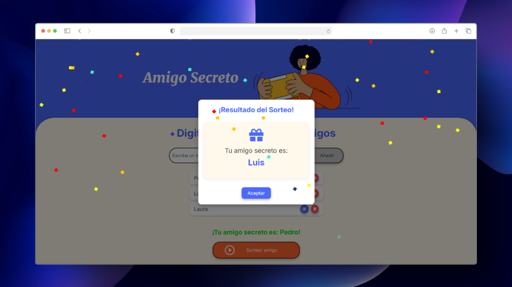
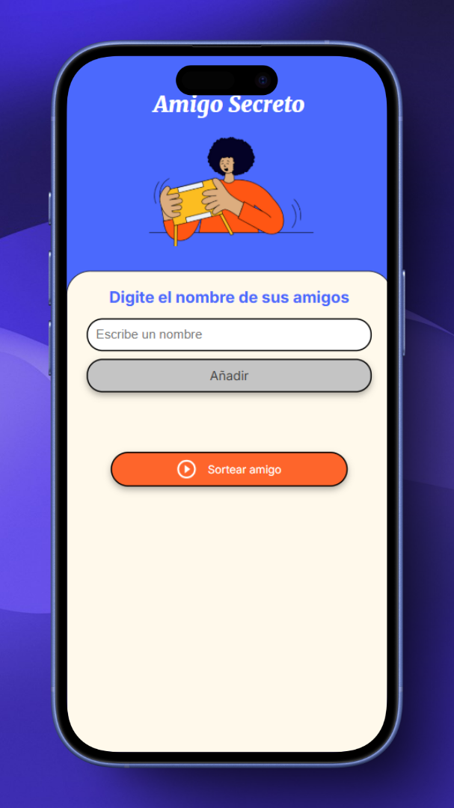

# Amigo Secreto 🎁

[](https://developer.mozilla.org/en-US/docs/Web/HTML)
[](https://developer.mozilla.org/en-US/docs/Web/CSS)
[](https://developer.mozilla.org/en-US/docs/Web/JavaScript)
[](https://developer.mozilla.org/en-US/docs/Learn/CSS/CSS_layout/Responsive_Design)
[](https://opensource.org/licenses/MIT)
[](https://github.com/sandovaldavid/challenge-01-secret-friend/releases/tag/v1.0.0)

Una aplicación web interactiva para organizar sorteos de amigo secreto con una interfaz amigable y
animaciones atractivas.

## 🌐 Demo

### Vista previa

<div align="center">
  <table>
    <tr>
      <td align="center">
        <h3>Vista de Escritorio</h3>
        
      </td>
      <td align="center">
        <h3>Vista Móvil</h3>
        
      </td>
    </tr>
  </table>
</div>

Para ver la aplicación en funcionamiento, accede a la
[demo en vivo](https://amigo-secreto.devsandoval.me).

## 📝 Descripción

**Amigo Secreto** es una aplicación web que permite a los usuarios organizar sorteos de "amigo
secreto" de manera sencilla y divertida. Esta herramienta facilita la asignación aleatoria entre un
grupo de amigos, familiares o compañeros de trabajo para intercambios de regalos.

El objetivo principal del proyecto es proporcionar una solución digital al tradicional sorteo
manual, ofreciendo una experiencia de usuario agradable con animaciones y efectos visuales que hacen
el proceso más entretenido.

## ✨ Características

-   **Añadir participantes**: Interfaz sencilla para agregar nombres a la lista.
-   **Edición de nombres**: Edición de participantes directamente en la lista o mediante ventanas
    modales.
-   **Eliminación de participantes**: Posibilidad de quitar personas de la lista con confirmación.
-   **Sorteo aleatorio**: Selección aleatoria de un amigo secreto entre los participantes.
-   **Animaciones**: Efecto de confeti al mostrar el resultado del sorteo.
-   **Notificaciones**: Sistema de mensajes para informar al usuario sobre las acciones realizadas.
-   **Diseño responsivo**: Adaptable a diferentes tamaños de pantallas (móviles, tablets y
    escritorio).
-   **Edición inline**: Edición rápida haciendo doble clic en los nombres.

## 🔄 Versiones

### [v1.0.0](https://github.com/sandovaldavid/challenge-01-secret-friend/releases/tag/v1.0.0) - Abril 21, 2025

Versión inicial con todas las funcionalidades básicas. Consulta las
[notas de la versión](./release-v1.0.0.md) para más detalles.

## 🌐 Demo

Para ver la aplicación en funcionamiento, accede a la
[demo en vivo](https://amigo-secreto.devsandoval.me).

## 🛠️ Tecnologías utilizadas

-   HTML5
-   CSS3 (Variables CSS, Flexbox, Media Queries)
-   JavaScript (ES6+)
-   Font Awesome (Iconos)
-   Google Fonts (Inter, Merriweather)

## 🚀 Instalación y uso

Para utilizar esta aplicación de forma local, sigue estos pasos:

1. **Clona el repositorio**:

```bash
git clone https://github.com/sandovaldavid/challenge-01-secret-friend.git
cd challenge-01-secret-friend
```

2. **Abre el proyecto**:

    - Abre el archivo index.html en tu navegador preferido.
    - También puedes usar un servidor local como Live Server en Visual Studio Code.

3. **Uso de la aplicación**:
    - Ingresa los nombres en el campo de texto y haz clic en "Añadir" o presiona Enter.
    - Los nombres aparecerán en una lista debajo del campo de entrada.
    - Para editar un nombre, haz doble clic sobre él o usa el botón de edición.
    - Para eliminar un nombre, utiliza el botón de eliminación.
    - Cuando hayas añadido todos los participantes, haz clic en "Sortear amigo" para realizar el
      sorteo.

## 📂 Estructura del proyecto

```
├── app.js              # Lógica de la aplicación
├── assets/
│   ├── amigo-secreto.png       # Imagen principal del banner
│   └── play_circle_outline.png # Icono del botón de sorteo
    └── desktop-demo.png        # Vista escritorio
    └── mobile-demo.png         # Vista mobile
├── index.html          # Estructura HTML de la página
├── README.md           # Documentación del proyecto
└── style.css           # Estilos y responsividad
```

## 📱 Responsividad

La aplicación está diseñada para ser completamente responsiva:

-   **Escritorio**: Experiencia completa con espaciado amplio y animaciones fluidas.
-   **Tablet**: Interfaz adaptada con componentes redimensionados para pantallas medianas.
-   **Móvil**: Diseño optimizado para interacción táctil con botones más grandes y layout vertical.
-   **Móvil en horizontal**: Layout especial para dispositivos móviles en orientación horizontal.

## 🔮 Mejoras futuras

-   **Sorteo completo**: Asignar a cada participante un amigo secreto distinto en lugar de
    seleccionar uno solo.
-   **Persistencia de datos**: Guardar los nombres en localStorage para no perderlos al recargar.
-   **Exportación**: Permitir guardar o compartir los resultados del sorteo.
-   **Temas visuales**: Opción para cambiar entre tema claro/oscuro.
-   **Funcionalidad de grupos**: Crear múltiples grupos para diferentes eventos o equipos.
-   **Integración con redes sociales**: Compartir resultados en plataformas sociales.

## 🤝 Contribuciones

Las contribuciones son bienvenidas. Para contribuir:

1. Haz un fork del proyecto
2. Crea una rama para tu función (`git checkout -b feature/amazing-feature`)
3. Haz commit de tus cambios (`git commit -m 'Add some amazing feature'`)
4. Push a la rama (`git push origin feature/amazing-feature`)
5. Abre un Pull Request

## 📄 Licencia

Este proyecto está bajo la Licencia MIT - mira el archivo LICENSE para detalles.

---

## 👨‍💻 Autor

### [David Sandoval](https://github.com/sandovaldavid)

-   🌐 Portafolio: [devsandoval.me](https://devsandoval.me)
-   💼 LinkedIn: [@devsandoval](https://linkedin.com/in/devsandoval)
-   💻 GitHub: [@sandovaldavid](https://github.com/sandovaldavid)
-   📧 Email: [contact@devsandoval.me](mailto:contact@devsandoval.me)

---

Desarrollado por [@sandovaldavid](https://github.com/sandovaldavid)

---

> **Nota**: Este proyecto fue creado con fines educativos y de entretenimiento. Siéntete libre de
> utilizarlo y modificarlo según tus necesidades.
